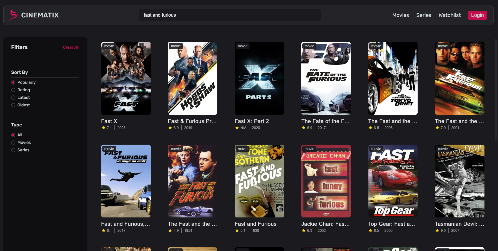

# 🎬 Cinematix

A movie web application built with Vite and React to explore and discover movies.

## Deployment

Deployed Website: [https://cinematix-stergios.netlify.app/](cinematix-stergios.netlify.app)

## About The Project

[](https://cinematix-stergios.netlify.app)

Cinematix is a React-based web application designed for movie enthusiasts to search, filter, and browse movies. The application includes features such as popularity sorting, rating-based filtering, and the ability to distinguish between movies and series. It also integrates the YouTube API to fetch and display trailers for movies and series. The app leverages modern React tools, including React Router for navigation and Vite for bundling.

## Usage

1. Search for your favorite movies or series using the search bar.

2. Filter movies by popularity, rating, latest, or oldest.

3. Toggle between movies and series views using the type filter.

4. Browse detailed movie information by clicking on a specific movie card.

### Built With

This app is built using React and modern tools and libraries.

- [React](https://reactjs.org/)
- [Vite](https://vitejs.dev/)
- [React Router](https://reactrouter.com/)
- [CSS](https://developer.mozilla.org/en-US/docs/Web/CSS)
- [JavaScript](https://developer.mozilla.org/en-US/docs/Web/JavaScript)

## Getting Started

To get a local copy up and running, follow these simple steps.

### Prerequisites

Make sure you have Node.js and npm installed on your system.

- [Node.js](https://nodejs.org/)
- [npm](https://www.npmjs.com/)

### Installation

1. Clone the repo:

   ```bash
   git clone https://github.com/StergiosF/Cinematix
   ```

2. Navigate to the project directory:

   ```bash
   cd [project-directory]
   ```

3. Install NPM packages:

   ```bash
   npm install
   ```

4. Start the development server:

   ```bash
   npm run dev
   ```
